# Attack tolerance of complex networks

相关运行结果、代码和数据文件等已上传https://github.com/Getttttttt/Attack-Tolerance-Of-Complex-Networks

## 1. 阅读本周参考资料。

### 论文内容介绍

#### 恶意攻击的方法论
这篇论文主要研究了复杂网络面对随机错误和有意攻击时的鲁棒性差异。通过分析两种基本的网络模型——指数网络（Exponential Networks）和无标度网络（Scale-Free Networks），作者发现无标度网络显示出对随机故障的惊人容忍度，但同时极易受到有意攻击的影响。这一发现是通过模拟节点移除对网络直径的影响来证明的，其中网络直径是衡量网络连通性的一个关键指标。

#### 攻击顺序和重要性指标
作者通过优先移除网络中连接数最多的节点来模拟有意的攻击。研究表明，在无标度网络中，这种针对性攻击会迅速破坏网络的连通性，导致网络分裂为许多孤立的部分。而在指数网络中，由于节点的连接数相对均匀，无论是随机故障还是有意攻击，网络的连通性下降都较为缓慢。

#### 结论与网络鲁棒性的衡量
本研究得出的关键结论是，无标度网络对随机故障表现出较高的容忍度，但对有意攻击却极为脆弱。网络的鲁棒性不仅取决于其冗余的连接方式，还受到网络连接分布的强烈影响。此外，文章还通过分析网络的片段化过程，即移除节点后网络分裂的情况，进一步证明了这一点。对于无标度网络，随机故障导致的片段化发生得较慢，而有意攻击则迅速导致网络的分裂，从而证明了其对攻击的脆弱性。

#### 鲁棒性的数学模型
鲁棒性的衡量基于网络的直径变化以及网络片段化的过程，具体可以通过以下数学表达式描述：
- 直径\(d\)的变化，作为网络连通性的一个度量，随节点移除比例\(f\)的增加而变化。
- 网络片段化过程中，最大集群的相对大小\(S\)和孤立集群的平均大小\(s\)随\(f\)的变化情况。

通过这些模型，作者展示了不同网络对故障和攻击的响应，从而量化了攻击后的网络鲁棒性。


## 2. 从Index of Complex Networks（https://icon.colorado.edu）上下载技术网络Gnutella p2p networks，并进行恶意攻击实验，观察最大连通分支占网络规模($P_{\infty}$)随攻击比例($f$)的变化。参照1中资料的思路，比较不同节点重要性度量方法在攻击中的差异。假定$P_{\infty}$<0.8时，对应的$f$为$f_c$，请比较本周给出的几类重要性指标中，哪个指标的攻击性更强（即$f_c$最小）。注意，可以在攻击时提前计算好所有节点的重要性并排序，实验时分别尝试不同的攻击比例，如0.01, 0.02，0.05等。另外，注意nx.Graph的copy方法，因为网络结构在攻击中被会破坏，需要保存初始复本，以用于其他$f$。

(2 和 3 作业合并完成)

## 3. 在2中，同时观察第二大连通分支占网络规模的比例随$f$的变化规律，并观察有无稳定的现象出现。

### 具体实现代码

```python
import os
import networkx as nx
import numpy as np
import matplotlib.pyplot as plt
import pandas as pd
from collections import defaultdict

class NetworkAttacker:
    def __init__(self, file_path, directed=True):
        self.file_path = file_path
        self.network_name = os.path.splitext(os.path.basename(file_path))[0]
        # directed
        self.G = self.load_network(file_path, directed)
        '''
        undirected:
        self.G = self.load_network(file_path,directed=False)
        '''
        self.results_dir = self.create_results_directory()
        self.save_network()
        
        # Prepare dictionaries for results
        self.P_infinity_results = defaultdict(dict)
        self.second_largest_cc_results = defaultdict(dict)

    def load_network(self, file_path, directed):
        if file_path.endswith('.txt') or file_path.endswith('.csv'):
            if directed:
                G = nx.read_edgelist(file_path, create_using=nx.DiGraph())
            else:
                G = nx.read_edgelist(file_path, create_using=nx.Graph())
        else:
            raise ValueError("Unsupported file format. Please provide a .txt or .csv file.")
        return G

    def create_results_directory(self):
        results_dir = os.path.join(os.getcwd(), self.network_name)
        if not os.path.exists(results_dir):
            os.makedirs(results_dir)
        return results_dir

    def save_network(self):
        net_file_path = os.path.join(self.results_dir, f"{self.network_name}.net")
        nx.write_pajek(self.G, net_file_path)

    def calculate_centrality_measures(self):
        measures = {
            'in_degree_centrality': nx.in_degree_centrality(self.G),
            'out_degree_centrality': nx.out_degree_centrality(self.G),
            'betweenness_centrality': nx.betweenness_centrality(self.G),
            'eigenvector_centrality': nx.eigenvector_centrality(self.G, max_iter=10000, tol=1e-06),
            'pagerank': nx.pagerank(self.G),
            'core_number': nx.core_number(self.G),
            'closeness_centrality': nx.closeness_centrality(self.G),
            'katz_centrality': nx.katz_centrality(self.G, max_iter=1000, tol=1e-06)
        }
        '''
        undirected:
        measures = {
            'degree_centrality': nx.degree_centrality(self.G),
            'betweenness_centrality': nx.betweenness_centrality(self.G),
            'eigenvector_centrality': nx.eigenvector_centrality(self.G, max_iter=100000, tol=1e-06),
            'pagerank': nx.pagerank(self.G),
            'core_number': nx.core_number(self.G),
            'closeness_centrality': nx.closeness_centrality(self.G),
            'katz_centrality': nx.katz_centrality(self.G, max_iter=100000, tol=1e-06)
        }
        '''
        return measures

    def simulate_attack(self, importance_measure, measure_name):
        # Reset G_copy for each simulation
        G_copy = self.G.copy()
        # Initialize results storage for P_infinity and second largest component
        results = defaultdict(list)
        second_largest_cc_results = defaultdict(list)
        for f in np.arange(0.01, 1.01, 0.01):  # Adjusted to simulate a wider range of f
            G_copy = self.G.copy()
            num_to_remove = int(np.ceil(f * len(G_copy.nodes())))
            nodes_sorted_by_importance = sorted(importance_measure.items(), key=lambda x: x[1], reverse=True)
            nodes_to_remove = [n for n, _ in nodes_sorted_by_importance[:num_to_remove]]
            G_copy.remove_nodes_from(nodes_to_remove)
            
            # Calculate the largest and second largest strongly connected components
            ccs = sorted([cc for cc in nx.strongly_connected_components(G_copy)], key=len, reverse=True)
            ''' 
            undirected:
            ccs = sorted([cc for cc in nx.connected_components(G_copy)], key=len, reverse=True)
            '''
            largest_cc = ccs[0] if ccs else []
            second_largest_cc = ccs[1] if len(ccs) > 1 else []
            P_infinity = len(largest_cc) / len(self.G.nodes()) if self.G.nodes() else 0
            P_second = len(second_largest_cc) / len(self.G.nodes()) if self.G.nodes() else 0
            
            # Store the results
            results[f].append(P_infinity)
            second_largest_cc_results[f].append(P_second)
        
        # Save results to class variables for later use
        self.P_infinity_results[measure_name] = results
        self.second_largest_cc_results[measure_name] = second_largest_cc_results
    
    def plot_results(self):
        plt.figure(figsize=(14, 7))
        
        # Subplot for the largest connected component
        plt.subplot(1, 2, 1)
        for measure_name, results in self.P_infinity_results.items():
            fs = list(results.keys())
            P_infinities = [results[f][0] for f in fs]
            plt.plot(fs, P_infinities, label=measure_name)

        plt.xlabel('Fraction of Nodes Removed (f)')
        plt.ylabel('Largest Connected Component (P_infinity)')
        plt.title('Network Robustness: Largest CC'+self.network_name)
        plt.legend()

        # Subplot for the second largest connected component
        plt.subplot(1, 2, 2)
        for measure_name, results in self.second_largest_cc_results.items():
            fs = list(results.keys())
            P_second_largest = [results[f][0] for f in fs]
            plt.plot(fs, P_second_largest, label=measure_name, linestyle='--')

        plt.xlabel('Fraction of Nodes Removed (f)')
        plt.ylabel('Second Largest Connected Component')
        plt.title('Network Robustness: Second Largest CC'+self.network_name)
        plt.legend()

        plt.tight_layout()
        plt.savefig(os.path.join(self.results_dir, 'Combined_CC_Results.png'))
        plt.close()

    def main_experiment(self):
        centrality_measures = self.calculate_centrality_measures()
        fc_values = {}

        for measure_name, measure in centrality_measures.items():
            self.simulate_attack(measure, measure_name)
        
        self.plot_results()

        # Prepare DataFrame for results
        df_P_infinity = pd.DataFrame()
        df_second_largest = pd.DataFrame()

        for measure_name in centrality_measures.keys():
            df_P_infinity[measure_name] = pd.Series([val[0] for val in self.P_infinity_results[measure_name].values()])
            df_second_largest[measure_name] = pd.Series([val[0] for val in self.second_largest_cc_results[measure_name].values()])

        # Write results to CSV
        df_P_infinity.to_csv(os.path.join(self.results_dir, 'P_infinity_results.csv'), index_label='f')
        df_second_largest.to_csv(os.path.join(self.results_dir, 'second_largest_cc_results.csv'), index_label='f')
        
        # Calculate fc values and save to CSV
        for measure_name, results in self.P_infinity_results.items():
            fc = min([f for f, P_infinity_list in results.items() if P_infinity_list[0] < 0.8], default=None)
            if fc is not None:
                fc_values[measure_name] = fc

        pd.DataFrame.from_dict(fc_values, orient='index', columns=['fc']).to_csv(os.path.join(self.results_dir, 'fc_values.csv'))

        return fc_values

if __name__ == "__main__":
    file_paths = ['p2p-Gnutella04.txt','p2p-Gnutella05.txt','p2p-Gnutella06.txt','p2p-Gnutella08.txt','p2p-Gnutella09.txt','p2p-Gnutella24.txt','p2p-Gnutella25.txt','p2p-Gnutella30.txt','p2p-Gnutella31.txt',]
    for file_path in file_paths:  
        attacker = NetworkAttacker(file_path)
        fc_values = attacker.main_experiment()
        print("Critical fraction values (f_c) for each centrality measure:")
        for measure, f_c in fc_values.items():
            print(f"{measure}: {f_c}")

```

在本次作业中，分别以directed和undirected进行处理，一下分别报告结果：

### Directed Graph

#### 结果图

下方分别是p2p-Gnutella九个网络图，以有向图进行处理时（按照原本的网络类型）的结果图片：

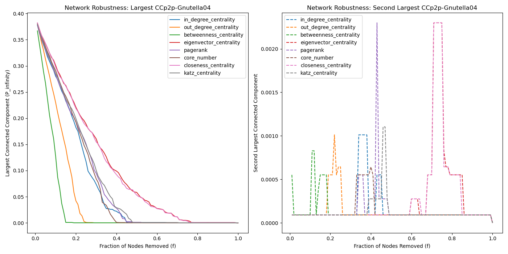

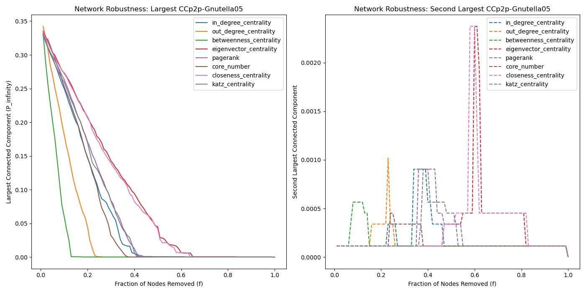

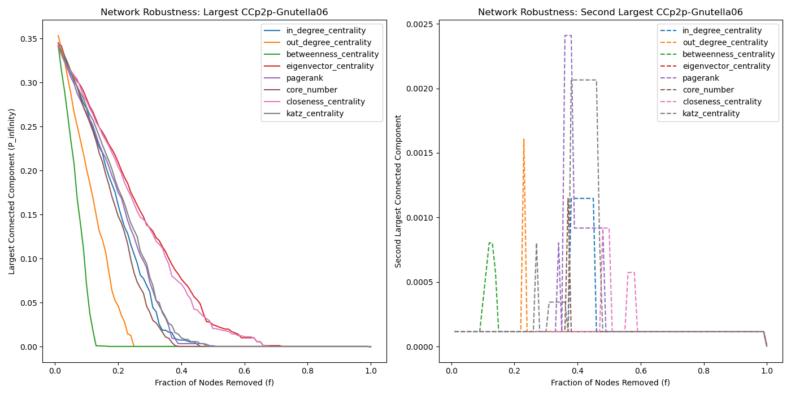

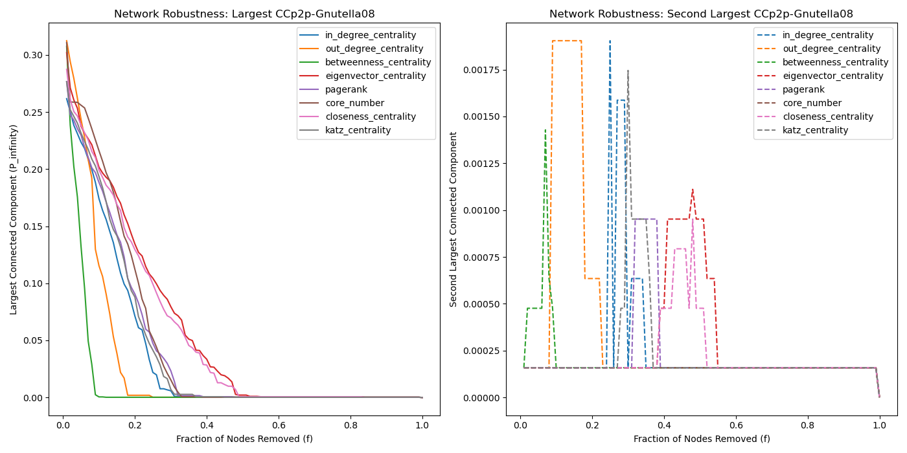

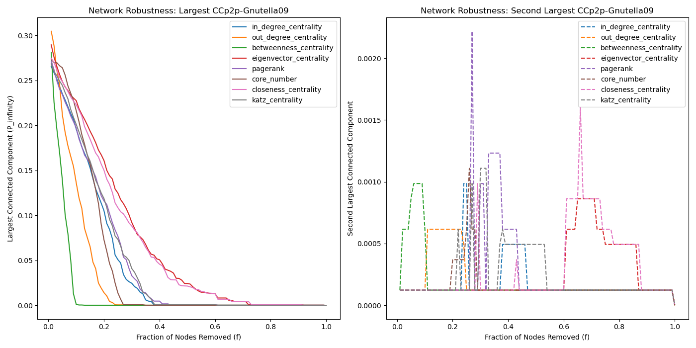

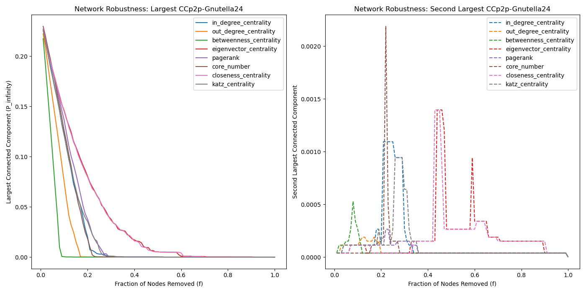

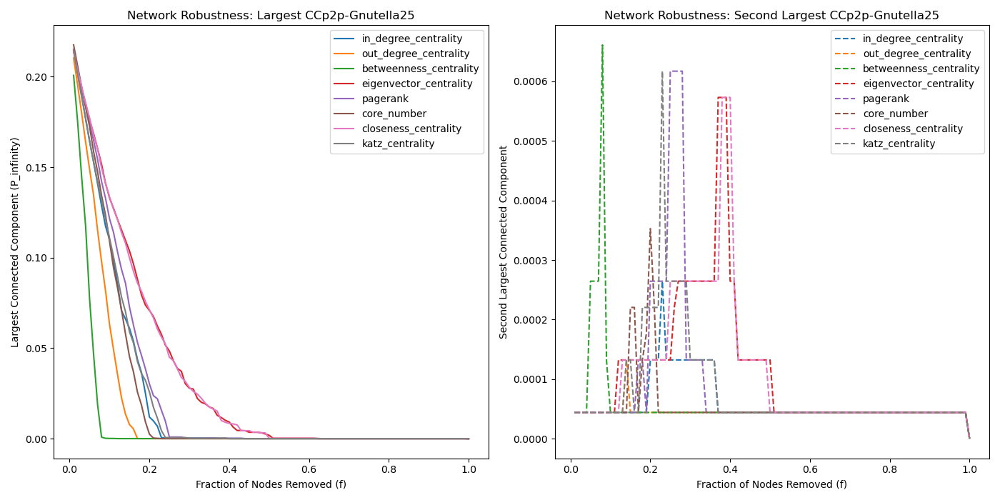

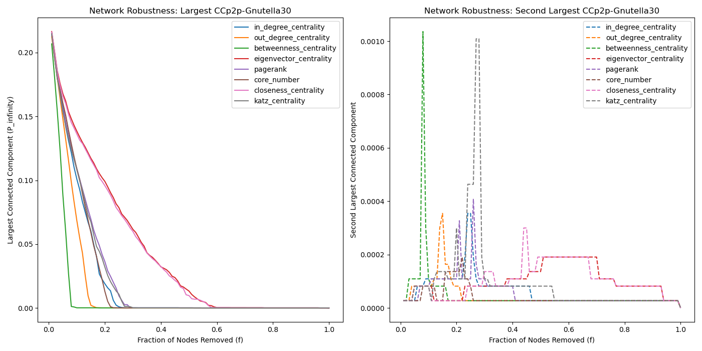

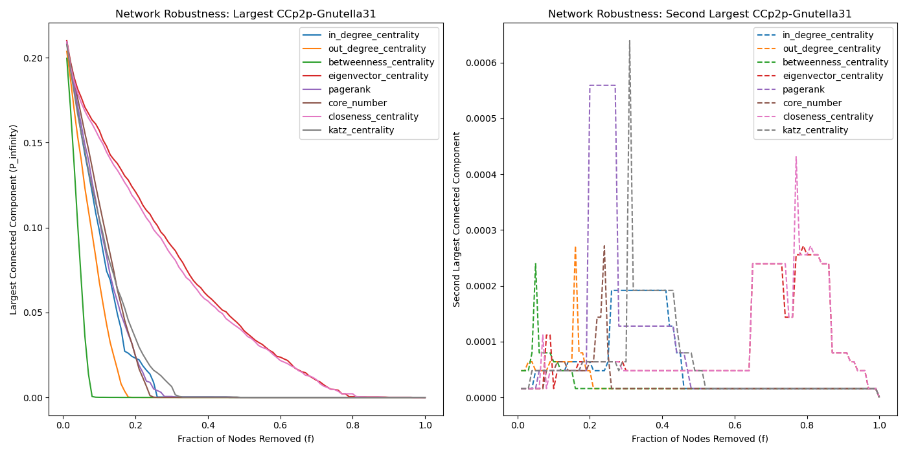

#### 结果表

对于有向图而言，0.8的临界值过大，输出结果全为0.01，因此不用表格展示。在下一节中，无向图处理部分通过表格展示差异。

#### 分析与讨论

通过上述运行结果进行分析，可以得到以下结论：

1) 在全部的结果中，$P_{\infty}$呈现降低速度先快后慢的趋势。其中针对**Betweenness-centrality攻击性最强**，由高到低进行攻击时，$P_{\infty}$衰落的速度最快；而对于closeness-centrality和eigenvector-centrality由高到低进行攻击时，$P_{\infty}$衰落的速度最慢。在有向图中，由于节点的入度和出度可能不同，这种不对等性使得针对性攻击尤其有效。特别是当攻击目标是那些**高出度（out-degree-centrality的攻击性明显优于in-degree-centrality）**的节点时，即那些能够将信息传播到网络其他部分的“广播”节点，网络的连通性会迅速下降。这说明了在社交网络等有向图中，某些关键节点的存在对于整个网络的信息流动至关重要。
1) 第二联通分量占比的变化趋势，呈现“先增长-后降低”的倒U形山峰曲线。针对于不同指标的高低顺序攻击时，不同网络图达到倒U形“峰顶”的顺序相同，但是峰顶的相对高低不存在普遍规律。有向图在面对攻击时，可能会出现片段化的情况，即网络被分割成多个相互独立的子网络。这种片段化过程在有向图中尤为复杂，因为即使两个节点之间存在路径，信息的流动方向也可能导致实际上的通信受阻。例如，一个节点可能能够通过出度到达另一个节点，但反过来就不行，这增加了在设计鲁棒网络时需要考虑的因素。 
1) 对于所有节点重要性指标进行攻击时，$P_{\infty}$和第二联通分量占比随攻击比例的增长呈现相同的变化趋势：即当$P_{\infty}$衰落至最低点时，第二联通分量占比达到最高点“峰顶”处。即对于节点重要性进行攻击的时候，会使得第二联通分量不断发展，两者之间有明确的相关关系。

### Undirected Graph

#### 结果图

下方分别是p2p-Gnutella九个网络图，以无向图进行处理时（按照原本的网络类型）的结果图片：

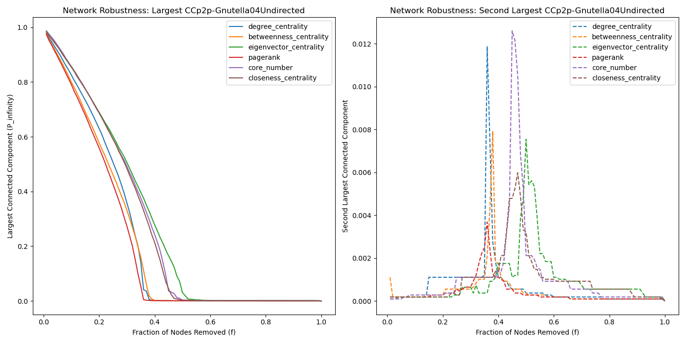

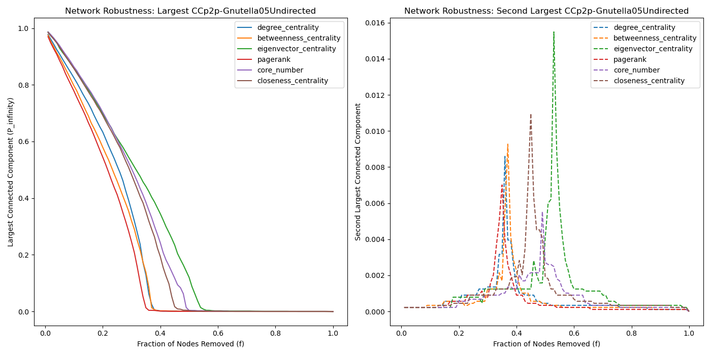

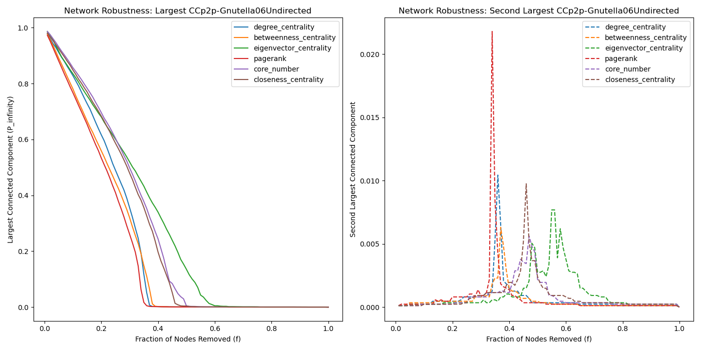

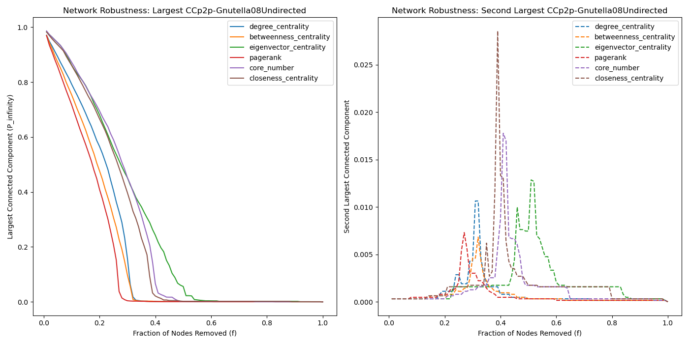

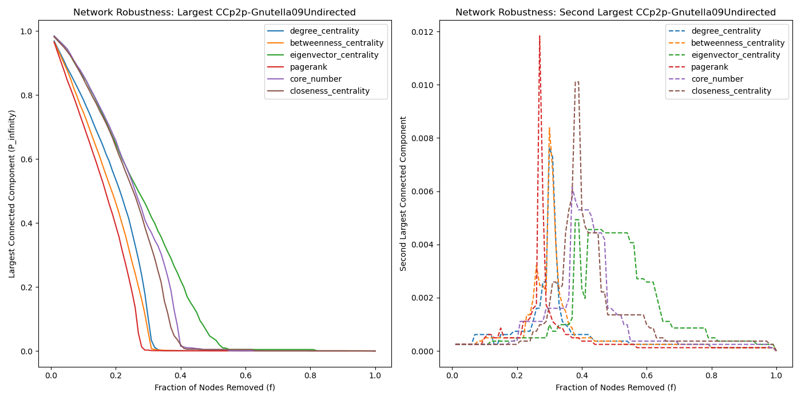

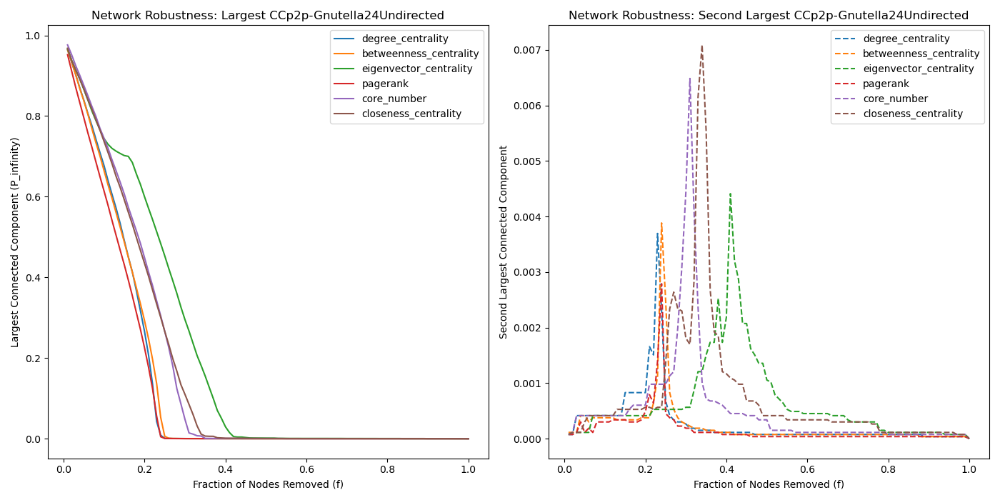

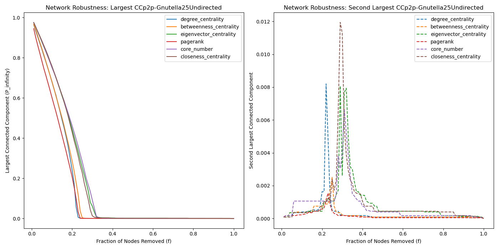

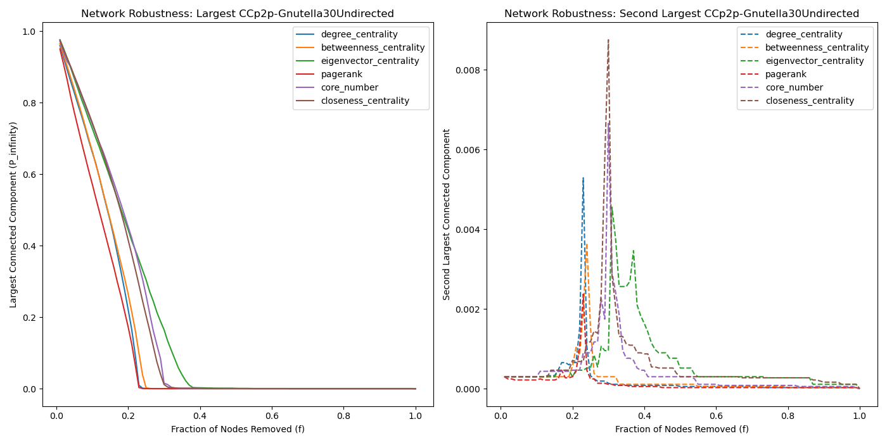

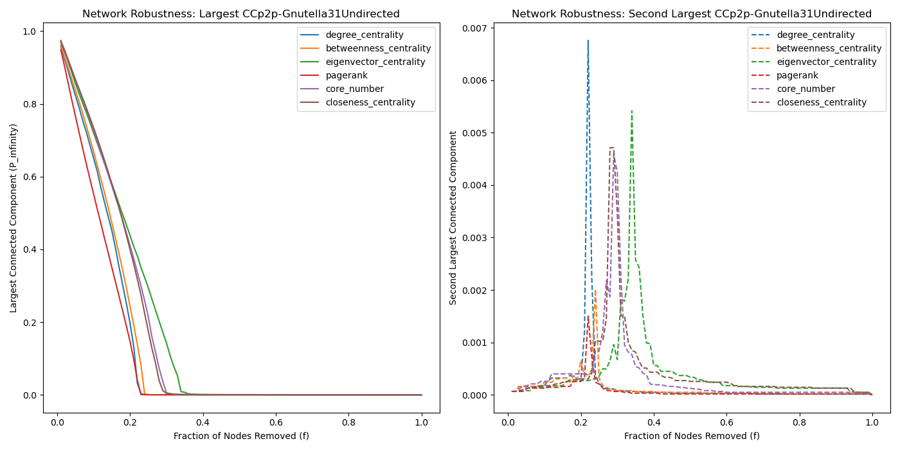

#### 结果表

| Indicator              | p2p-Gnutella04Undirected | p2p-Gnutella05Undirected | p2p-Gnutella06Undirected | p2p-Gnutella08Undirected | p2p-Gnutella09Undirected | p2p-Gnutella24Undirected | p2p-Gnutella25Undirected | p2p-Gnutella30Undirected | p2p-Gnutella31Undirected |
| ---------------------- | ------------------------ | ------------------------ | ------------------------ | ------------------------ | ------------------------ | ------------------------ | ------------------------ | ------------------------ | ------------------------ |
| degree_centrality      | 0.12                     | 0.12                     | 0.12                     | 0.1                      | 0.1                      | 0.07                     | 0.07                     | 0.06                     | 0.06                     |
| betweenness_centrality | 0.1                      | 0.1                      | 0.1                      | 0.09                     | 0.08                     | 0.07                     | 0.07                     | 0.07                     | 0.07                     |
| eigenvector_centrality | 0.14                     | 0.14                     | 0.13                     | 0.15                     | 0.14                     | 0.08                     | 0.09                     | 0.08                     | 0.08                     |
| pagerank               | 0.1                      | 0.09                     | 0.09                     | 0.07                     | 0.07                     | 0.05                     | 0.05                     | 0.05                     | 0.05                     |
| core_number            | 0.14                     | 0.15                     | 0.14                     | 0.15                     | 0.14                     | 0.08                     | 0.09                     | 0.08                     | 0.08                     |
| closeness_centrality   | 0.14                     | 0.14                     | 0.14                     | 0.14                     | 0.13                     | 0.08                     | 0.09                     | 0.08                     | 0.08                     |

#### 分析与讨论

通过上述运行结果进行分析，可以得到以下结论：

1) 与有向图不同，无向图随着攻击比例的增大，$P_{\infty}$呈现衰落速度不断增加，直到为0的趋势。其中，page-rank的攻击性最强，betweenness-centrality其次（有向图中攻击性最强的指标）；而core_number攻击性最弱，和有向图中存在差异。在无向图中，节点的重要性更加倾向于它们在网络中的位置，而非它们的方向性角色。因此，度中心性、接近中心性和中介中心性等指标在无向图中对于识别关键节点可能更为有效。这些节点通常位于网络的中心位置，连接着多个不同的社区或群体，它们的移除会迅速导致网络的分裂。
2) 第二联通分量占比的变化趋势，呈现“先增长-后降低”的倒U形山峰曲线。针对于不同指标的高低顺序攻击时，不同网络图达到倒U形“峰顶”的顺序相同，但是峰顶的相对高低不存在普遍规律。$P_{\infty}$和第二联通分量占比随攻击比例的增长呈现相同的变化趋势：即当$P_{\infty}$衰落至最低点时，第二联通分量占比达到最高点“峰顶”处，与有向图结果相同。在无向图中，随着网络的攻击和节点的移除，第二大连通分支的出现反映了网络开始出现显著的片段化现象。这一指标可以作为网络开始失去整体连通性的一个早期信号。不同于有向图，无向图中第二大连通分支的大小增加通常伴随着主要连通分支的快速减小，这一点在社交网络分析中尤其重要，因为它可能预示着社区的形成或信息流动的阻碍。
3) 相比于对于有向图的攻击，无向图$P_{\infty}$初始值更高，衰落方式不同“加速衰落-水平为0“的衰落方式。相比于有向图，无向图中节点之间的连接是双向的，这意味着任意两个直接连接的节点都可以相互通信。因此，当进行攻击，尤其是随机攻击时，无向图的连通性通常会比有向图更为稳定。然而，针对性地移除高度中心性的节点仍然可以快速破坏网络的连通性，尽管这种效应可能没有在有向图中那么显著。

## 4. 在社交媒体中一些场景中，会有社交关系的“失效”，如取消关注、拉黑等。思考并讨论这类行为如何与复杂网络的鲁棒性关联及其可能导致的影响。

复杂网络的鲁棒性与社交媒体中的社交关系“失效”:

### 社交网络的鲁棒性

在前面的题目1-3中已经进行了讨论和实验，网络鲁棒性描述的是网络在面对节点或边的失效时，能够维持其基本功能和结构的能力。这种失效可以是随机的（网络故障），也可以是有针对性的攻击（恶意攻击），比如按照节点重要性进行攻击。对于社交媒体这样的网络，节点代表个体，边代表个体间的社交关系，如好友关系、关注关系等。

### 社交关系“失效”

在社交媒体环境中，社交关系的“失效”通常指的是取消关注、拉黑或删除好友等行为，这些行为直接导致社交网络中边的移除。从网络科学的角度来看，这种行为改变了网络的结构，可能影响到网络的连通性、聚集系数、路径长度等重要特征。社交媒体中的社交关系“失效”是复杂网络鲁棒性研究中的一个实际场景，这类行为不仅影响网络的结构和功能，也反映了网络中个体的社交动态。理解这些行为对网络造成的影响有助于设计更加鲁棒、更能促进积极社交互动的社交媒体平台。

### 影响分析

1. **影响网络连通性**：社交关系的失效可能导致某些节点变得孤立，失去与网络其他部分的联系，从而影响网络的连通性。在某些极端情况下，大量的社交关系失效可能导致网络分裂成多个较小的孤立群体。《乌合之众》这本书中有相关的讨论，当一个大的群体被分裂成多个较小的孤立群体时，很可能会导致不同群体之间的冲突。

2. **聚集系数的变化**：聚集系数是衡量网络中节点间紧密程度的指标。社交关系的失效可能导致某些社区或群体内的聚集系数下降，因为成员间的直接联系减少了。进一步，社交网络平台的聚集系数降低，会导致平台用户交互降低，活跃度下降，降低社交平台流量和市场估值。

3. **路径长度的增加**：在社交网络中，路径长度通常代表了信息传播的速度和效率。社交关系的失效可能导致有效路径的减少，使得信息传播需要更长的路径，从而降低传播效率。

### 举例分析

以Twitter为例，当一位用户开始大量取消关注其他用户时，不仅减少了其直接的社交联系，也可能间接影响到其他用户间的连接，尤其是如果被取消关注的用户是一个“桥接节点”，连接了两个本来互不直接联系的社群。长期来看，这种行为如果在网络中普遍发生，可能会导致社交网络的碎片化，形成更多的局部社群，但这些社群之间的联系却变得更加稀薄。

### 社交平台应对策略

社交媒体平台可以采取一系列措施来增强网络的鲁棒性，如鼓励用户建立更多的社交连接、使用算法推荐可能感兴趣的新朋友或内容、优化信息传播机制等。通过这些方式，即使部分社交关系发生了“失效”，网络整体的结构和功能也能得到维持。
